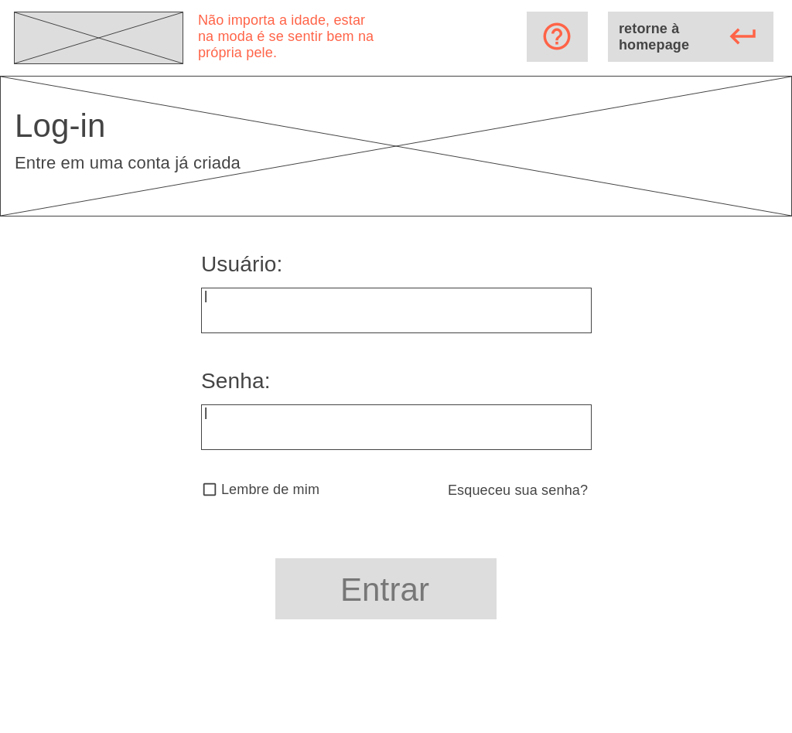

# Informações do Projeto
`TÍTULO DO PROJETO`  

Old Fashioned

`CURSO` 

Ciência da Computação

## Participantes

> Os membros do grupo são: 
> - Sophia Carrazza Ventorim de Sousa
> - Brenda Cristina Martins Araújo
> - Breno Pires Santos

# Estrutura do Documento

- [Informações do Projeto](#informações-do-projeto)
  - [Participantes](#participantes)
- [Estrutura do Documento](#estrutura-do-documento)
- [Introdução](#introdução)
  - [Problema](#problema)
  - [Objetivos](#objetivos)
  - [Justificativa](#justificativa)
  - [Público-Alvo](#público-alvo)
- [Especificações do Projeto](#especificações-do-projeto)
  - [Personas, Empatia e Proposta de Valor](#personas-empatia-e-proposta-de-valor)
  - [Histórias de Usuários](#histórias-de-usuários)
  - [Requisitos](#requisitos)
    - [Requisitos Funcionais](#requisitos-funcionais)
    - [Requisitos não Funcionais](#requisitos-não-funcionais)
  - [Restrições](#restrições)
- [Projeto de Interface](#projeto-de-interface)
  - [User Flow](#user-flow)
  - [Wireframes](#wireframes)
- [Metodologia](#metodologia)
  - [Divisão de Papéis](#divisão-de-papéis)
  - [Ferramentas](#ferramentas)
  - [Controle de Versão](#controle-de-versão)
- [**############## SPRINT 1 ACABA AQUI #############**](#-sprint-1-acaba-aqui-)
- [Projeto da Solução](#projeto-da-solução)
  - [Tecnologias Utilizadas](#tecnologias-utilizadas)
  - [Arquitetura da solução](#arquitetura-da-solução)
- [Avaliação da Aplicação](#avaliação-da-aplicação)
  - [Plano de Testes](#plano-de-testes)
  - [Ferramentas de Testes (Opcional)](#ferramentas-de-testes-opcional)
  - [Registros de Testes](#registros-de-testes)
- [Referências](#referências)

# Introdução

## Problema

A moda é um dos setores de maior movimentação de capital no mundo, mas quase inteiramente focada no público jovem, com uma grande exclusão da terceira idade nesse meio. Segundo o SPC Brasil (Serviço de Proteção ao Cliente), das 36 milhões de pessoas acima de 60 anos na população brasileira, 34% sente falta dos produtos de moda quando vão às compras. Dessa forma, existe uma relação conflituosa entre os idosos e a atualização nas tendências atuais sobre moda, na qual eles não conseguem procurar ou encontrar roupas condizentes com seu estilo único, personalidade e orçamento, e acabam por se contentar com roupas determinadas padrões da terceira idade e logo têm a autoestima diminuída por não se sentirem representados pelo próprio estilo.

> Nesse momento você deve apresentar o problema que a sua aplicação deve
> resolver. No entanto, não é a hora de comentar sobre a aplicação.
> Descreva também o contexto em que essa aplicação será usada, se
> houver: empresa, tecnologias, etc. Novamente, descreva apenas o que de
> fato existir, pois ainda não é a hora de apresentar requisitos
> detalhados ou projetos.
>
> Nesse momento, o grupo pode optar por fazer uso
> de ferramentas como Design Thinking, que permite um olhar de ponta a
> ponta para o problema.
>
> **Links Úteis**:
> - [Objetivos, Problema de pesquisa e Justificativa](https://medium.com/@versioparole/objetivos-problema-de-pesquisa-e-justificativa-c98c8233b9c3)
> - [Matriz Certezas, Suposições e Dúvidas](https://medium.com/educa%C3%A7%C3%A3o-fora-da-caixa/matriz-certezas-suposi%C3%A7%C3%B5es-e-d%C3%BAvidas-fa2263633655)
> - [Brainstorming](https://www.euax.com.br/2018/09/brainstorming/)

## Objetivos

Objetivo geral:  
Visto o problema da inexistência de uma moda orientada para os idosos, o projeto Old Fashioned visa desenvolver um software que auxilia pessoas da terceira idade a escolher e adquirir roupas condizentes com o estilo, personalidade e evento desejado, por meio de um layout que mostra produtos linkados a lojas de acordo com os filtros selecionados (orçamento, coloração pessoal ou cor do próprio produto, personalidade e evento) para fazê-las se sentirem bem com o próprio estilo.

Objetivos específicos: 
 - Tornar mais fácil a busca dos idosos por roupas que condizem com seu estilo e para inspiração de estilo.
 - Deixar a interface e o layout simples e grande para facilitar o entendimento 
 - Criar uma ferramenta de likes para salvar em pastas diferentes criadas pelo usuário.
 - Adicionar quizzes de coloração pessoal e de personalidade básicos para aumentar a efetividade dos filtros.
 - Adicionar layouts que simulem chats para trazer dinamicidade e estímulo.
 - Deixar a proposta final inovadora para ajudar eficientemente o público-alvo.

> Aqui você deve descrever os objetivos do trabalho indicando que o
> objetivo geral é desenvolver um software para solucionar o problema
> apresentado acima. Apresente também alguns (pelo menos 2) objetivos
> específicos dependendo de onde você vai querer concentrar a sua
> prática investigativa, ou como você vai aprofundar no seu trabalho.
> 
> **Links Úteis**:
> - [Objetivo geral e objetivo específico: como fazer e quais verbos utilizar](https://blog.mettzer.com/diferenca-entre-objetivo-geral-e-objetivo-especifico/)

## Justificativa

A criação do Old Fashioned foi influenciada pela percepção da dificuldade que muitos de nossos avós têm com a moda, seja ao procurar roupas que gostem, seja por pensar em peças que sejam adequadas a eles em determinados eventos. Ao analisarmos o dia a dia e as pesquisas sobre nossa realidade, vimos a importância da criação de um projeto que ajude os idosos a encontrar seu estilo em uma indústria que os exclui e que assume que essa parcela não se importa com sua própria aparência. Uma das grandes necessidades da população idosa, por exemplo, é a modelagem específica, que não é vista nas roupas do mercado. Além disso, um relatório do Sebrae de 2016 apontou que 73% dos consumidores idosos classificam o atendimento no varejo como regular, algo claramente resultante da falta de marketing voltado para esse público, e também da falta de acessibilidade em empresas que não consideram essa parcela ao criar blogs e aplicativos voltados à moda.

Ainda assim, segundo dados da multinacional de painéis de consumo Kantar, famílias de idosos apresentam índices positivos de consumo e gastam mais na compra de todas as categorias quando comparados com a média geral da população. Portanto, é visível que esse é um nicho que não pode mais ser ignorado no mercado. Assim, o projeto auxiliará a parcela sênior da sociedade a escolher e adquirir roupas condizentes com o estilo, tamanho, personalidade e evento desejado, com uma interface acessível e lúdica, já que, independentemente da idade, o importante é se sentir bem com a própria imagem. 

> Descreva a importância ou a motivação para trabalhar com esta aplicação
> que você escolheu. Indique as razões pelas quais você escolheu seus
> objetivos específicos ou as razões para aprofundar em certos aspectos
> do software.
> 
> O grupo de trabalho pode fazer uso de questionários, entrevistas e
> dados estatísticos, que podem ser apresentados, com o objetivo de
> esclarecer detalhes do problema que será abordado pelo grupo.
>
> **Links Úteis**:
> - [Como montar a justificativa](https://guiadamonografia.com.br/como-montar-justificativa-do-tcc/)

## Público-Alvo

Geral:  

Homens e mulheres acima de 60 anos, casados, com filhos e netos e que são aposentados. Moradores tanto da capital quanto do interior, que desejam encontrar uma forma mais fácil de achar ideias de roupas para vestir e comprar de acordo com a moda atual e que, ao mesmo tempo, sejam adequadas para o tamanho e o estilo deles. 

Específico por variáveis:
 - Geográfica: Moram no Brasil, embora pessoas de todos os países consigam utilizar o site, e vivem na zona urbana.

 - Demográfica: Indivíduos com mais de 60 anos (idosos), normalmente casados ou viúvos, com filhos, aposentados e de situação social média.

 - Psicográfica: Possuem um estilo de vida mais calmo, com hábitos saudáveis e interesses em eventos sociais dentro da zona de conforto (encontros de família e de igreja, por exemplo) e em se sentir bem no geral, incluindo sua própria aparência.

 - Comportamental: É um público que vem crescendo muito no meio digital, possui um comportamento facilmente influenciável pela mídia e tem grande potencial de crescer no nicho da moda e-commerce, já que a moda sênior também é emergente no cenário atual. No entanto, os idosos ainda têm grande dificuldade com a falta de acessibilidade e interfaces intuitivas construídas para eles na internet, o que deve ser um fator de mudança no projeto para encaixá-lo corretamente no perfil da terceira idade.

> Descreva quem serão as pessoas que usarão a sua aplicação indicando os
> diferentes perfis. O objetivo aqui não é definir quem serão os
> clientes ou quais serão os papéis dos usuários na aplicação. A ideia
> é, dentro do possível, conhecer um pouco mais sobre o perfil dos
> usuários: conhecimentos prévios, relação com a tecnologia, relações
> hierárquicas, etc.
>
> Adicione informações sobre o público-alvo por meio de uma descrição
> textual, ou diagramas de personas, mapa de stakeholders, ou como o
> grupo achar mais conveniente.
> 
> **Links Úteis**:
> - [Público-alvo: o que é, tipos, como definir seu público e exemplos](https://klickpages.com.br/blog/publico-alvo-o-que-e/)
> - [Qual a diferença entre público-alvo e persona?](https://rockcontent.com/blog/diferenca-publico-alvo-e-persona/)
 
# Especificações do Projeto

A seguir encontram-se as personas, empatias e propostas de valor, além de fluxos e histórias de usuários e como o site será apresentado a ele. Em um todo, essa seção é focada na idealização do usuário e do site voltado para tal cliente. 
Para isso, as ferramentas utilizadas para esta construção foram o site Miro, as entrevistas para a criação das personas e do design inteligente, o site Thispersondoesnotexist para a idealização da aparência dos personas, a criação de Google Docs compartilhados para a aglutinação de ideias em um só lugar, o site Trello para a organização dessas tarefas no geral e, por fim, diversas pesquisas sobre o assunto da moda para idosos com a finalidade de compreender melhor as dores e os remédios para a realidade do nosso usuário e a finalmente criar suas histórias e mapas de empatia e valor.

> Apresente uma visão geral do que será abordado nesta parte do
> documento, enumerando as técnicas e/ou ferramentas utilizadas para
> realizar a especificações do projeto

## Personas, Empatia e Proposta de Valor

As personas do projeto Old Fashioned são idosos que são amigos desde a infância quando moravam na mesma cidade. Mesmo com muitas semelhanças, como a dificuldade de encontrar roupas que os agradem e estejam de acordo com a moda atual e pensamentos parecidos, cada um possui personalidades bastante distintas uma da outra, e sentem a necessidade de encontrar sua própria imagem distinta por meio do estilo. Assim, Esmeralda, Antônio e Viviane serão muito bem atendidos pelo site Old Fashioned, o qual agrupa os clientes e as lojas de roupas sem afiliações com o site (para ser uma busca imparcial monetariamente).

> Relacione as personas identificadas no seu projeto, os respectivos mapas de empatia e 
> mapas da proposta de valor. Lembre-se que você deve ser enumerar e descrever precisamente 
> e de forma personalizada todos os principais envolvidos com a solução almeja. 
> 
> Para tanto, baseie-se tanto nos documentos disponibilizados na disciplina
> e/ou nos seguintes links:
>
> **Links Úteis**:
> - [Persona x Público-alvo](https://flammo.com.br/blog/persona-e-publico-alvo-qual-a-diferenca/)
> - [O que é persona?](https://resultadosdigitais.com.br/blog/persona-o-que-e/)
> - [Rock Content](https://rockcontent.com/blog/personas/)
> - [Hotmart](https://blog.hotmart.com/pt-br/como-criar-persona-negocio/)
> - [Mapa de Empatia](https://resultadosdigitais.com.br/blog/mapa-da-empatia/)
> - [Como fazer um mapa de empatia - Vídeo](https://www.youtube.com/watch?v=JlKHGpVoA2Y)
> - [Canvas da Proposta de Valor](https://analistamodelosdenegocios.com.br/canvas-da-proposta-de-valor/)
> 
> 
> **Exemplo de Persona**
> 
> 
> 
> Fonte: [Como criar uma persona para o seu negócio](https://raissaviegas.com.br/como-criar-uma-persona/)
>
> **Exemplo de Proposta de Valor**
> 

## Histórias de Usuários

Com base na análise das personas foram identificadas as seguintes histórias de usuários:

|EU COMO... | QUERO/PRECISO ... `FUNCIONALIDADE`                 |PARA ... `MOTIVO/VALOR`                                                                         |
|-----------|----------------------------------------------------|------------------------------------------------------------------------------------------------|
| Antonio   | Comprar roupas esportivas de forma facilitada      | Para conseguir assistir os jogos de futebol utilizando o uniforme dos times favoritos dos netos|
| Esmeralda | Se atualizar nas tendências de moda                | Para se inserir na moda atual.                                                                 |
| Viviane   | Necessito de roupas mais variadas                  | Para poder ter um visual para cada ocasião de sua vida.                                        |
| Esmeralda | Preciso de ajuda na minha indecisão.               | Para diminuir o tempo que eu gasto para me arrumar.                                            |
| Antonio   | Preciso de um menu de fácil entendimento           | Para eu poder navegar mais facilmente pelo site, sem precisar da ajuda dos meus netos.         |
| Viviane   | Gostaria de um filtro para escolher a cor da roupa | O filtro seria importante para eu poder realizar meu sonho de ter uma roupa de cada cor.       |
| Admin     | Poder de abrir chat com qualquer cliente           | Realizar um suporte individualizado                                                            |

> Apresente aqui as histórias de usuário que são relevantes para o
> projeto de sua solução. As Histórias de Usuário consistem em uma
> ferramenta poderosa para a compreensão e elicitação dos requisitos
> funcionais e não funcionais da sua aplicação. Se possível, agrupe as
> histórias de usuário por contexto, para facilitar consultas
> recorrentes à essa parte do documento.
>
> **Links Úteis**:
> - [Histórias de usuários com exemplos e template](https://www.atlassian.com/br/agile/project-management/user-stories)
> - [Como escrever boas histórias de usuário (User Stories)](https://medium.com/vertice/como-escrever-boas-users-stories-hist%C3%B3rias-de-usu%C3%A1rios-b29c75043fac)

## Requisitos

As tabelas que se seguem apresentam os requisitos funcionais e não funcionais que detalham o escopo do projeto.

### Requisitos Funcionais

|ID    | Descrição do Requisito  | Prioridade |
|------|-----------------------------------------|----|
|RF-001| Permitir que o usuário cadastre tarefas | ALTA | 
|RF-002| Emitir um relatório de tarefas no mês   | MÉDIA |

### Requisitos não Funcionais

|ID     | Descrição do Requisito  |Prioridade |
|-------|-------------------------|----|
|RNF-001| O sistema deve ser responsivo para rodar em um dispositivos móvel | MÉDIA | 
|RNF-002| Deve processar requisições do usuário em no máximo 3s |  BAIXA | 

> Com base nas Histórias de Usuário, enumere os requisitos da sua
> solução. Classifique esses requisitos em dois grupos:
>
> - [Requisitos Funcionais (RF)](https://pt.wikipedia.org/wiki/Requisito_funcional):
>   correspondem a uma funcionalidade que deve estar presente na
>   plataforma (ex: cadastro de usuário).
>
> - [Requisitos Não Funcionais (RNF)](https://pt.wikipedia.org/wiki/Requisito_n%C3%A3o_funcional):
>   correspondem a uma característica técnica, seja de usabilidade,
>   desempenho, confiabilidade, segurança ou outro (ex: suporte a
>   dispositivos iOS e Android).
>
> Lembre-se que cada requisito deve corresponder à uma e somente uma
> característica alvo da sua solução. Além disso, certifique-se de que
> todos os aspectos capturados nas Histórias de Usuário foram cobertos.
> 
> **Links Úteis**:
> 
> - [O que são Requisitos Funcionais e Requisitos Não Funcionais?](https://codificar.com.br/requisitos-funcionais-nao-funcionais/)
> - [O que são requisitos funcionais e requisitos não funcionais?](https://analisederequisitos.com.br/requisitos-funcionais-e-requisitos-nao-funcionais-o-que-sao/)

## Restrições

O projeto está restrito pelos itens apresentados na tabela a seguir.

|ID| Restrição                                             |
|--|-------------------------------------------------------|
|01| O projeto deverá ser entregue até o final do semestre |
|02| Não pode ser desenvolvido um módulo de backend        |

> Enumere as restrições à sua solução. Lembre-se de que as restrições
> geralmente limitam a solução candidata.
> 
> **Links Úteis**:
> - [O que são Requisitos Funcionais e Requisitos Não Funcionais?](https://codificar.com.br/requisitos-funcionais-nao-funcionais/)
> - [O que são requisitos funcionais e requisitos não funcionais?](https://analisederequisitos.com.br/requisitos-funcionais-e-requisitos-nao-funcionais-o-que-sao/)

# Projeto de Interface

A Interface do Projeto Old Fashioned foi pensada para apresentar um layout que, ao mesmo tempo que é elegante, também é acessível para o usuário idoso. Tornamos a acessibilidade um dos focos principais para a aparência e a funcionalidade do site, com a adição de letras maiores e caixas de texto destacadas que se diferem o bastante ao ponto de separarem cada informação de forma eficaz e de simples entendimento. Além disso, implementamos elementos que deixam o site com um aspecto mais casual e lúdico para combinar com o perfil de usuário, como cores que representam o calor e a alegria, o layout que simula chats de conversação com o mascote para dar um tom de intimidade com o cliente, muitas opções de filtros e especificações para agradar qualquer tipo de gostos e a implementação de páginas de ajuda e de contato para suporte, com tutoriais de como utilizar cada interface do site caso ainda haja dúvidas. Portanto, a Old Fashioned visa um projeto de interface intuitivo e simplificado para todos os clientes.

> Apresente as principais interfaces da solução. Discuta como 
> foram elaboradas de forma a atender os requisitos funcionais, não
> funcionais e histórias de usuário abordados nas [Especificações do
> Projeto](#especificações-do-projeto).

## User Flow

> Fluxo de usuário (User Flow) é uma técnica que permite ao desenvolvedor
> mapear todo fluxo de telas do site ou app. Essa técnica funciona
> para alinhar os caminhos e as possíveis ações que o usuário pode
> fazer junto com os membros de sua equipe.
>
> **Links Úteis**:
> - [User Flow: O Quê É e Como Fazer?](https://medium.com/7bits/fluxo-de-usu%C3%A1rio-user-flow-o-que-%C3%A9-como-fazer-79d965872534)
> - [User Flow vs Site Maps](http://designr.com.br/sitemap-e-user-flow-quais-as-diferencas-e-quando-usar-cada-um/)
> - [Top 25 User Flow Tools & Templates for Smooth](https://www.mockplus.com/blog/post/user-flow-tools)
>
> **Exemplo**:

## Wireframes
 
-Homepage do site com botões para as diversas opções de testes, login e signup, ajuda e suporte, os favoritos salvos e uma página de informações sobre teoria das cores:
 

-Inicio do teste para a apresentação das roupas com um chat que simula uma conversação:
 

-Página em que o usuário seleciona os filtros para deixar o teste de pesquisa mais especifico, ainda dentro da conversação:
 

-Página de resultado da pesquisa, em que o mascote, na conversação, responde o usuário com as melhores escolhas:
 

-Layout da apresentação de uma peça de roupa, com sua descrição (tamanho, textura, materiais), aspectos que fazem essa roupa ser compatível com o usuário e a opção de curti-la:
 

-Layout da apresentação de uma peça de roupa como o outro, mas com a especificação de que ela já está curtida pelo usuário:
 

-Página da resposta de uma busca rápida feita pelo usuário com as opções de vestimentas:
 

-Página com as pastas de peças de roupas salvas que o usuário já criou de acordo com seu interesse:
 

-Página com as peças de roupas salvas dentro de uma pasta selecionada:
 

-Layout da página de como a conta do usuário será apresentada:
 

-Página da inserção de dados pelo usuário para a entrada em uma conta já existente no site:
 

-Página da inserção de dados pelo usuário para a criação de uma conta no site, com informações necessárias na hora do teste-busca de roupas (gênero e idade):
 

-Página com elementos de ajuda, acessibilidade, informações e uma caixa para mensagens ao sistema de suporte caso necessário:
 

-Wireframe da página de informações sobre a teoria das cores na moda, com as especificações do que cada uma representa e pode passar aos olhos alheios para auxiliar o usuário na decisão da cor de uma roupa:
 

-Wireframe da página do teste de personalidade com o link para um teste externo e o reconhecimento desse resultado para especificar e deixar os testes-busca mais eficazes para o usuário:
 

> 
> Wireframes são protótipos das telas da aplicação usados em design de interface para sugerir a
> estrutura de um site web e seu relacionamentos entre suas
> páginas. Um wireframe web é uma ilustração semelhante ao
> layout de elementos fundamentais na interface.
> 
> **Links Úteis**:
> - [Ferramentas de Wireframes](https://rockcontent.com/blog/wireframes/)
> - [Figma](https://www.figma.com/)
> - [Adobe XD](https://www.adobe.com/br/products/xd.html#scroll)
> - [MarvelApp](https://marvelapp.com/developers/documentation/tutorials/)
> 
> **Exemplo**:
> 
>

# Metodologia

......  COLOQUE AQUI O SEU TEXTO ......

> Nesta parte do documento, você deve apresentar a metodologia 
> adotada pelo grupo, descrevendo o processo de trabalho baseado nas metodologias ágeis, 
> a divisão de papéis e tarefas, as ferramentas empregadas e como foi realizada a
> gestão de configuração do projeto via GitHub.
>
> Coloque detalhes sobre o processo de Design Thinking e a implementação do Framework Scrum seguido
> pelo grupo. O grupo poderá fazer uso de ferramentas on-line para acompanhar
> o andamento do projeto, a execução das tarefas e o status de desenvolvimento
> da solução.
> 
> **Links Úteis**:
> - [Tutorial Trello](https://trello.com/b/8AygzjUA/tutorial-trello)
> - [Gestão ágil de projetos com o Trello](https://www.youtube.com/watch?v=1o9BOMAKBRE)
> - [Gerência de projetos - Trello com Scrum](https://www.youtube.com/watch?v=DHLA8X_ujwo)
> - [Tutorial Slack](https://slack.com/intl/en-br/)

## Divisão de Papéis

[Divisao de Papeis - Link](https://trello.com/b/h3I0xK2p/divis%C3%A3o-de-pap%C3%A9is-tiaw) 

[Kanban - Link](https://trello.com/b/bItzCrxk/kanban-template-tiaw)  

> Apresente a divisão de papéis e tarefas entre os membros do grupo.
>
> **Links Úteis**:
> - [11 Passos Essenciais para Implantar Scrum no seu Projeto](https://mindmaster.com.br/scrum-11-passos/)
> - [Scrum em 9 minutos](https://www.youtube.com/watch?v=XfvQWnRgxG0)

## Ferramentas

| Ambiente  | Plataforma              |Link de Acesso |
|-----------|-------------------------|---------------|
|Processo de Design Thinkgin  | Miro |  https://miro.com/app/board/uXjVMU7S6fM=/ | 
|Repositório de código | GitHub | https://github.com/ICEI-PUC-Minas-PMGCC-TI/ti-1-pmg-cc-m-20231-tiaw-moda-para-idosos | 
|Hospedagem do site | Heroku |  https://XXXXXXX.herokuapp.com | 
|Protótipo Interativo | MavelApp | https://marvelapp.com/prototype/7742bb2 | 

>
> Liste as ferramentas empregadas no desenvolvimento do
> projeto, justificando a escolha delas, sempre que possível.
> 
> As ferramentas empregadas no projeto são:
> 
> - Editor de código.
> - Ferramentas de comunicação
> - Ferramentas de diagramação
> - Plataforma de hospedagem
> 
> O editor de código foi escolhido porque ele possui uma integração com o
> sistema de versão. As ferramentas de comunicação utilizadas possuem
> integração semelhante e por isso foram selecionadas. Por fim, para criar
> diagramas utilizamos essa ferramenta por melhor captar as
> necessidades da nossa solução.
> 
> **Links Úteis - Hospedagem**:
> - [Getting Started with Heroku](https://devcenter.heroku.com/start)
> - [Crie seu Site com o HostGator](https://www.hostgator.com.br/como-publicar-seu-site)
> - [GoDady](https://br.godaddy.com/how-to)
> - [GitHub Pages](https://pages.github.com/)

## Controle de Versão

......  COLOQUE AQUI O SEU TEXTO ......

> Discuta como a configuração do projeto foi feita na ferramenta de
> versionamento escolhida. Exponha como a gerência de tags, merges,
> commits e branchs é realizada. Discuta como a gerência de issues foi
> realizada.
> A ferramenta de controle de versão adotada no projeto foi o
> [Git](https://git-scm.com/), sendo que o [Github](https://github.com)
> foi utilizado para hospedagem do repositório `upstream`.
> 
> O projeto segue a seguinte convenção para o nome de branchs:
> 
> - `master`: versão estável já testada do software
> - `unstable`: versão já testada do software, porém instável
> - `testing`: versão em testes do software
> - `dev`: versão de desenvolvimento do software
> 
> Quanto à gerência de issues, o projeto adota a seguinte convenção para
> etiquetas:
> 
> - `bugfix`: uma funcionalidade encontra-se com problemas
> - `enhancement`: uma funcionalidade precisa ser melhorada
> - `feature`: uma nova funcionalidade precisa ser introduzida
>
> **Links Úteis**:
> - [Tutorial GitHub](https://guides.github.com/activities/hello-world/)
> - [Git e Github](https://www.youtube.com/playlist?list=PLHz_AreHm4dm7ZULPAmadvNhH6vk9oNZA)
> - [5 Git Workflows & Branching Strategy to deliver better code](https://zepel.io/blog/5-git-workflows-to-improve-development/)
>
> **Exemplo - GitHub Feature Branch Workflow**:
>
> 

# **############## SPRINT 1 ACABA AQUI #############**

# Projeto da Solução

......  COLOQUE AQUI O SEU TEXTO ......

## Tecnologias Utilizadas

......  COLOQUE AQUI O SEU TEXTO ......

> Descreva aqui qual(is) tecnologias você vai usar para resolver o seu
> problema, ou seja, implementar a sua solução. Liste todas as
> tecnologias envolvidas, linguagens a serem utilizadas, serviços web,
> frameworks, bibliotecas, IDEs de desenvolvimento, e ferramentas.
> Apresente também uma figura explicando como as tecnologias estão
> relacionadas ou como uma interação do usuário com o sistema vai ser
> conduzida, por onde ela passa até retornar uma resposta ao usuário.
> 
> Inclua os diagramas de User Flow, esboços criados pelo grupo
> (stoyboards), além dos protótipos de telas (wireframes). Descreva cada
> item textualmente comentando e complementando o que está apresentado
> nas imagens.

## Arquitetura da solução

......  COLOQUE AQUI O SEU TEXTO E O DIAGRAMA DE ARQUITETURA .......

> Inclua um diagrama da solução e descreva os módulos e as tecnologias
> que fazem parte da solução. Discorra sobre o diagrama.
> 
> **Exemplo do diagrama de Arquitetura**:
> 
> 

# Avaliação da Aplicação

......  COLOQUE AQUI O SEU TEXTO ......

> Apresente os cenários de testes utilizados na realização dos testes da
> sua aplicação. Escolha cenários de testes que demonstrem os requisitos
> sendo satisfeitos.

## Plano de Testes

......  COLOQUE AQUI O SEU TEXTO ......

> Enumere quais cenários de testes foram selecionados para teste. Neste
> tópico o grupo deve detalhar quais funcionalidades avaliadas, o grupo
> de usuários que foi escolhido para participar do teste e as
> ferramentas utilizadas.
> 
> **Links Úteis**:
> - [IBM - Criação e Geração de Planos de Teste](https://www.ibm.com/developerworks/br/local/rational/criacao_geracao_planos_testes_software/index.html)
> - [Práticas e Técnicas de Testes Ágeis](http://assiste.serpro.gov.br/serproagil/Apresenta/slides.pdf)
> -  [Teste de Software: Conceitos e tipos de testes](https://blog.onedaytesting.com.br/teste-de-software/)

## Ferramentas de Testes (Opcional)

......  COLOQUE AQUI O SEU TEXTO ......

> Comente sobre as ferramentas de testes utilizadas.
> 
> **Links Úteis**:
> - [Ferramentas de Test para Java Script](https://geekflare.com/javascript-unit-testing/)
> - [UX Tools](https://uxdesign.cc/ux-user-research-and-user-testing-tools-2d339d379dc7)

## Registros de Testes

......  COLOQUE AQUI O SEU TEXTO ......

> Discorra sobre os resultados do teste. Ressaltando pontos fortes e
> fracos identificados na solução. Comente como o grupo pretende atacar
> esses pontos nas próximas iterações. Apresente as falhas detectadas e
> as melhorias geradas a partir dos resultados obtidos nos testes.

# Referências

https://www.sebrae.com.br/sites/PortalSebrae/artigos/mercado-da-moda-para-a-terceira-idade-oportunidade-para-empreender,4408a81234761810VgnVCM100000d701210aRCRD

https://elle.com.br/moda/por-que-as-novas-geracoes-estao-obcecadas-com-a-moda-da-terceira-idade

https://jornalismorio.espm.br/destaque/o-setor-da-moda-e-a-exclusao-da-terceira-idade/

https://www.portaldoenvelhecimento.com.br/moda-especifica-para-idosos-quase-nao-existe/

https://acvida.com.br/familias/moda-sem-idade/

> Inclua todas as referências (livros, artigos, sites, etc) utilizados
> no desenvolvimento do trabalho.
> 
> **Links Úteis**:
> - [Formato ABNT](https://www.normastecnicas.com/abnt/trabalhos-academicos/referencias/)
> - [Referências Bibliográficas da ABNT](https://comunidade.rockcontent.com/referencia-bibliografica-abnt/)
